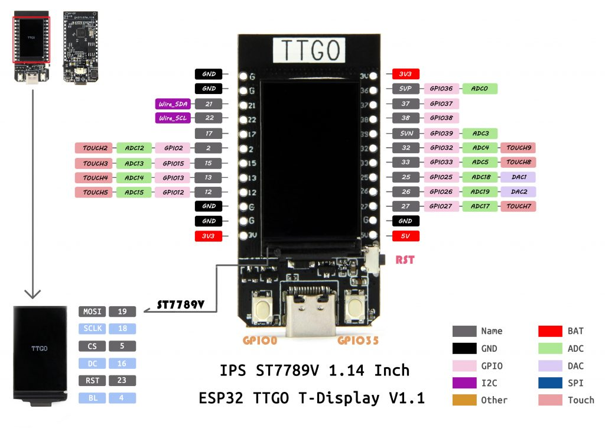

# ESPRESSIF based projects

[](https://github.com/aenniw/ESPRESSIF/actions?query=workflow%3A%22Platformio+build%22+branch%3Amaster)
[](https://www.paypal.com/cgi-bin/webscr?cmd=_donations&business=J96CRYPYAY2VE&currency_code=EUR&source=url)

<table>
  <tr>
    <td></td>
    <td></td>
    <td></td>
  </tr> 
</table>

## Setup environment

```bash
pip install -r requirements.txt
```

## Build

```bash
./make
```

## FAQ

- delta `BLE` firmware patch `detools create_patch -c heatshrink firmware-old.bin firmware.bin firmware.patch`